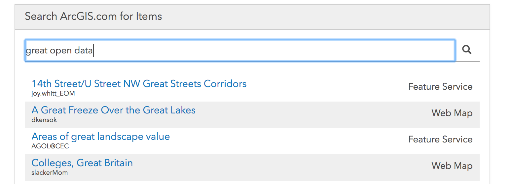

# ember-arcgis-portal-components

> Ember Components for interacting with ArcGIS Online/Enterprise items.

This repository contains standalone components from [ArcGIS Hub](https://hub.arcgis.com) for interacting with ArcGIS Online and Enterprise items, making it extremely simple to include a responsive search dialog in your own Ember, [Bootstrap](https://getbootstrap.com/) application.

Check out the [live demo](https://esri.github.io/ember-arcgis-portal-components/#/itempicker)



## Installation

```
ember install ember-arcgis-portal-components
```

## Components

### Item Picker

The item picker component allows a user to search a portal for items, see a preview of the item, and then get the item returned. While commonly used in a modal, the component can be used in any context.

### Layer Picker

Layer picker is part of the item picker. It allows for items with multiple layers to display them as radio buttons. This will then allow the user to select which layer they would like to use. The layer picker will display by default if the item is type `Feature Service` or `Map Service`.

### Generating a New Component

When generating a new component, please structure your files in the following order. This will help standardize the files and keep everything in an organized format:

1. Injections
2. Component stuff (classNames, tagName, etc)
3. Component lifecycle hooks (init, didInsertElement)
    * roughly in the order they happen
4. Properties
5. Computed properties
6. Functions
7. Actions

## Options for Item Picker
| Flag | Type | Required | Purpose |
|----|:-------:|:-------:|----------|
|   [selectAction]()   |     Function<br><small>(Closure Action)</small>      |   Yes   | This action is run when the `Select` button inside the item picker is pressed. This should be a closure action.   |
|  [searchItemsOnInit]()   |   Boolean   |No| Allows the item picker to execute a search and show the results as soon as it is rendered. This searches the active catalog on launch. If no active catalog is set, it will use the first available catalog. |
|   [selectMultiple]()   |   Boolean      |  No|  Allows the item picker to select multiple items at once. An <strong>array</strong> of items will be passed to the closure action.   |
|   [catalog]()   |    Array         |   No   | Allows the item picker to be filtered based on ArcGIS Online (AGO) queries. If the `catalog` array has more than one entry, a "facets" list will be shown on the left of the component, and it will use the `name` property. |
|   [onSelectionValidator]()   |    Function<br><small>(Closure Action)</small>  |   No   |    Allows an application to do more in-depth validation of an item before using it.  |
|  [portalOpts]()    |   Object      |  No    |   Allows a different portal to be assigned to an item picker.       |

### Examples

#### Default Usage (selectAction)

```js
{{item-picker
      selectAction=(action "onSelectItem")}}
```

#### Search on Initialize (searchItemsOnInit)

```js
{{item-picker
  searchItemsOnInit=true
  selectAction=(action "onSelectItem")}}
```

#### Multi-Select (selectMultiple)

```js
{{item-picker
  selectMultiple=true
  selectAction=(action "onSelectItem")}}
```

#### Facets (catalog)
This code will have two facets on the left hand side of the component. `All` and `Waste Water Apps`

In the controller:

```js
facets: [
  {
    name: 'All',
    params: {query: { access: 'public'}}
  },
  {
    name: 'Waste Water Apps',
    params: {
      query: {
        type: ['Web Mapping Application'],
        typekeywords: ['-story'],
        tags: ['Waste Water']
      }
    }
  }
]
```

In the template:

```js
{{item-picker
  searchItemsOnInit=true
  catalog=facets
  selectAction=(action "onSelectItem")}}
```

#### Validation (onSelectionValidator)

In the controller:

```js
actions: {
  selectionValidator(item) {
    // validation logic
    if (item.something) {
      return {
        item: item,
        status: 'error',
        message: 'This item can not be used because ...'
      }
    } else {
      // you can also manipulate the item here if you want...
      return {
        item: item,
        status: 'ok'
      };
    }
  }
}
```

In the template:

```js
{{item-picker
      selectAction=(action "onSelectItem")
      onSelectionValidator=(action "selectionValidator") }}
```

#### Portal Options (portalOpts)

In the controller:

```js
// in Controller
portalOpts: {
  portalBaseUrl: 'https://someotherportal.com',
  token: 'cb12---TOKEN-FOR-someotherportal.com---34..'
}
```
In the template:

```js
{{item-picker
      selectAction=(action "onSelectItem")
      portalOpts=portalOpts }}
```

### Setup

* `git clone https://github.com/Esri/ember-arcgis-portal-components`
* `cd ember-arcgis-portal-components`
* `npm install`
* `bower install`

### Running

* `ember serve`
* Visit your app at [http://localhost:4200](http://localhost:4200).

### Running Tests

* `npm test` (Runs `ember try:each` to test your addon against multiple Ember versions)
* `ember test`
* `ember test --server`

### Building

* `ember build`

For more information on using ember-cli, visit [https://ember-cli.com/](https://ember-cli.com/).

### Contributing

Esri welcomes contributions from anyone and everyone. Please see our [guidelines for contributing](https://github.com/Esri/contributing/blob/master/CONTRIBUTING.md).

### License

Copyright 2017 Esri

Licensed under the Apache License, Version 2.0 (the "License");
you may not use this file except in compliance with the License.
You may obtain a copy of the License at

> http://www.apache.org/licenses/LICENSE-2.0

Unless required by applicable law or agreed to in writing, software distributed under the License is distributed on an "AS IS" BASIS, WITHOUT WARRANTIES OR CONDITIONS OF ANY KIND, either express or implied.

See the License for the specific language governing permissions and limitations under the License.

A copy of the license is available in the repository's [LICENSE](./LICENSE) file.
